# Stitch

### Controller Logic Helper for Parameter Interactions

Stitch is a tool inspired by VRCFury (and integrating with it or Modular Avatar) that aims at the place VRCFury deliberately excludes from its scope - Controllers.  
Stitch can be used without VRCFury or Modular Avatar installed, but works better (automatically) alongside them.

### Usage

Stitch comes as a VPM package, so just click: , then add it to your project and you're all set!

In similar vein to other non-destructive editors, click Add Component at the bottom of any of your avatar's objects, and choose Stitch to use its features.

Stitch shows up as a simple menu with a list where you can add Actions.

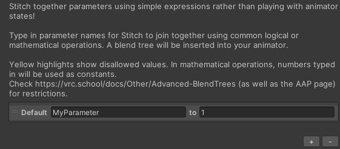

In the case VRCFury or Modular Avatar are not installed, after setting up Stitch, click Build & Test (or Build & Publish) in the VRChat SDK panel at which time Stitch will create a prefab with instructions to manually add the resulting controller to your avatar in whichever way you usually do it. The manual deployment method is not recommended, but included for completeness.

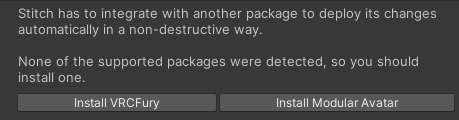

<h2>Actions</h2>

Technically, Stitch is a UI for [Advanced BlendTree Techniques](https://vrc.school/docs/Other/Advanced-BlendTrees).  
The created parameters are [AAPs](https://vrc.school/docs/Other/AAPs).  
The possibilities of those and their limitations apply.

### Add [+]

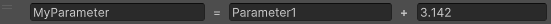

The Add action adds the values of two parameters.  
The input values are restricted in the range -100 to 100.  
For the mathematical actions, either parameter input can be replaced with a number - that number will be treated as a constant.

### And [∧]

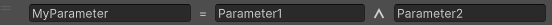

The And action is the AND logic gate.  
The output is on when both inputs are on.  
The input values are restricted in the range 0 to 1.

### Default

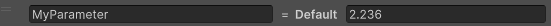

The Default action sets the default value of the parameter created in the controller.

### Gate

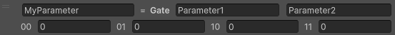

The Gate action is an arbitrary logic gate.  
The output can take one of four values depending on the inputs.  
The input values are restricted in the range 0 to 1.

The And action corresponds to a Gate of 0,0,0,1.  
The Or action corresponds to a Gate of 0,1,1,1.  
The Not action corresponds to a Gate of 1,0,0,0 with the same input parameter used twice.  
The above gates are used commonly enough they have their own more optimized actions, use those instead.

00 - Left and right inputs are zero.  
01 - Left input is zero, right input is one.  
eg.

### Global (VF, MA)

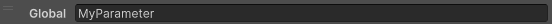

The Global action sets a parameter as Global in the Full Controller created by Stitch.  
By default, Stitch will use the features of VRCFury or Modular Avatar to prevent conflicts between parameters created through other means.  
Use this action when a parameter needs to be shared between different setups.

### Multiply [×]

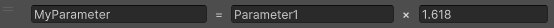

The Multiply action multiplies the values of two parameters.  
The input values are restricted in the range 0 to 10.  
For the mathematical actions, either parameter input can be replaced with a number - that number will be treated as a constant.

### Not [¬]

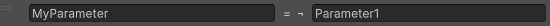

The Not action is the NOT logic gate.  
The output is on when the input is off.  
The input value is restricted in the range 0 to 1.  
This is equivalent to the Subtract action with 1 as the first parameter, this implementation is more performant.

### Or [∨]

The Or action is the OR logic gate.  
The output is on when either of the inputs is on.  
The input value is restricted in the range 0 to 1.

### Remap

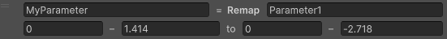

The Remap action allows modifying the range of values a parameter takes on.  
The output takes on a value based on the percentage along the input range.

For example, a remap of 0-1 to 2-0 will change values: 0 -> 2, 0.1 -> 1.8, 0.2 -> 1.6, 0.9 -> 0.2.

### Smooth

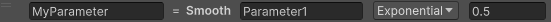

The Smooth action performs parameter smoothing over time.  
The output value will approach the input value smoothly over time based on the smoothing type and strength.  
The smoothing strength is restricted in the range 0 to 1.

### Subtract [−]

The Subtract action subtracts the value of one input from the other.  
The input values are restricted in the range -100 to 100.  
This is equivalent to the Add action with the second parameter negated.  
For the mathematical actions, either parameter input can be replaced with a number - that number will be treated as a constant.

Repo templated from https://github.com/vrchat-community/template-package.

