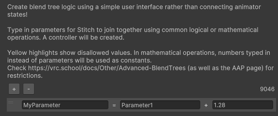
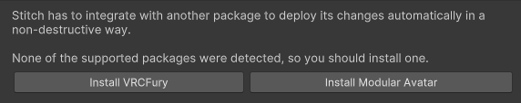

# Stitch

### Controller Logic Helper for Parameter Interactions

Stitch is a tool inspired by VRCFury (and integrating with it or Modular Avatar), which aims at the place VRCFury deliberately excludes from its scope - Controllers.  
Stitch requires VRCFury or Modular Avatar to be installed.

### Usage

Stitch is distributed as a VPM package, so just click: , then add it to any of your projects and you're all set!

Similarly to other non-destructive editors, click Add Component at the bottom of any of your avatar's objects, then choose Stitch to access its menu.

Stitch shows up as a simple menu with a list of Actions.

Technicality

Technically, Stitch is a UI for [Advanced BlendTree Techniques](https://vrc.school/docs/Other/Advanced-BlendTrees).  
The created parameters are [AAPs](https://vrc.school/docs/Other/AAPs).  
The possibilities of those and their limitations apply.

---

### Math > Add [+]

The Add action sums the values of two parameters.  
The input values are restricted in the range -100 to 100.  
Either input (but not both) can be replaced with a constant number.

### Logic > And [∧]

The And action performs the AND logic operation.  
The input values are restricted in the range 0 to 1.  
The output is on when both inputs are on.

### Parameter > Default

The Default action sets the starting value of the parameter created in the controller.

### Logic > Gate

The Gate action performs an arbitrary logic operation.  
The input values are restricted in the range 0 to 1.  
The output can take one of four values depending on the inputs.

00 - Left and right inputs are zero.  
01 - Left input is zero, right input is one.  
eg.

Common logic gates

The below gates are used commonly enough they have their own more optimized actions, use those instead.  
The And action corresponds to a Gate of 0,0,0,1.  
The Or action corresponds to a Gate of 0,1,1,1.  
The Not action corresponds to a Gate of 1,0,0,0 with the same input parameter used twice.

### Parameter > Global

By default, Stitch will use the features of VRCFury or Modular Avatar to prevent conflicts between parameters.  
Use this action when a parameter needs to be shared between different setups.

### Math > Multiply [×]

The Multiply action multiplies the values of two parameters.  
The input values are restricted in the range 0 to 10.  
Either input (but not both) can be replaced with a constant number.

### Logic > Not [¬]

The Not action performs the NOT logic operation.  
The input value is restricted in the range 0 to 1.  
The output is on when the input is off.  

For values between zero and one, this is equivalent to 1 - n.  
This implementation is more performant than the Subtract action.

### Logic > Or [∨]

The Or action perform the OR logic operation.  
The input value is restricted in the range 0 to 1.  
The output is on when either of the inputs is on.

### Parameter > Remap

The Remap action allows modifying the range of values a parameter takes on.  
The input range must be written in ascending order (second input larger than first).  
The output range must not be length zero (fourth input different from third).  
The output takes on a value based on the percentage along the input range.

For example, a remap of 0-1 to 2-0 will change values:  
  0 -> 2  
  0.1 -> 1.8  
  0.2 -> 1.6  
  0.9 -> 0.2

### Parameter > Smooth

The Smooth action performs parameter smoothing over time.  
The output value will approach the input value smoothly over time based on the smoothing type and strength.  
The smoothing strength is restricted in the range 0 to 1.

### Math > Subtract [−]

The Subtract action subtracts the value of one input from the other.  
The input values are restricted in the range -100 to 100.  
This is equivalent to the Add action with the second parameter negated.  
Either input (but not both) can be replaced with a constant number.

---

In the case VRCFury and Modular Avatar are not installed, after setting up Stitch, clicking Build & Test (or Build & Publish) in the VRChat SDK panel will create a prefab with instructions to install one of the dependencies.  
Clicking on either button will try to install the selected dependency in VCC.  
A similar error message is also displayed on the Stitch components.

Repo templated from https://github.com/vrchat-community/template-package.

